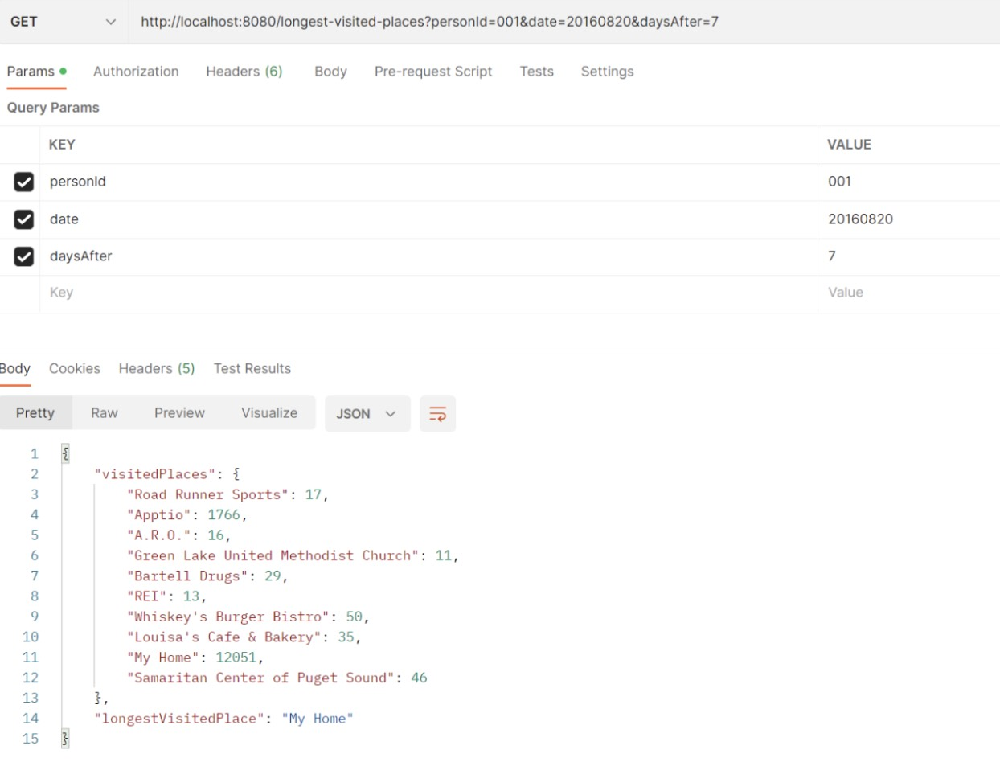
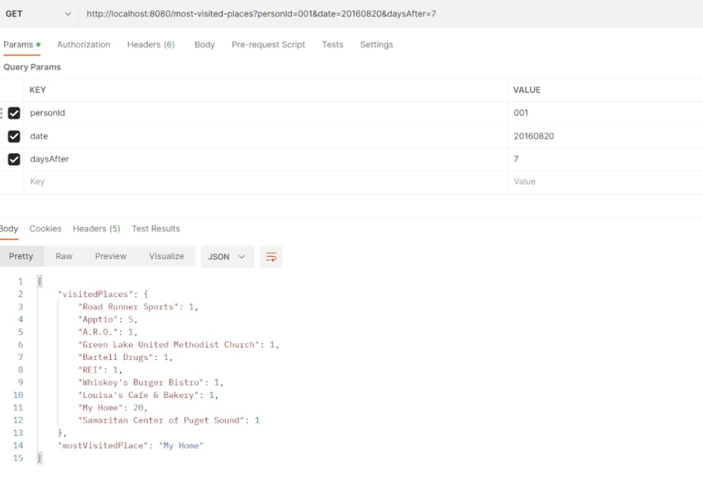
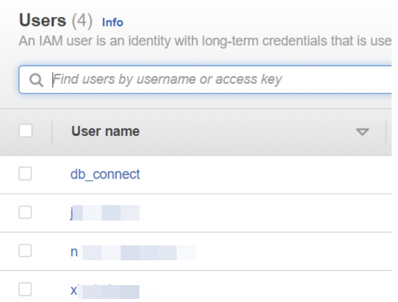
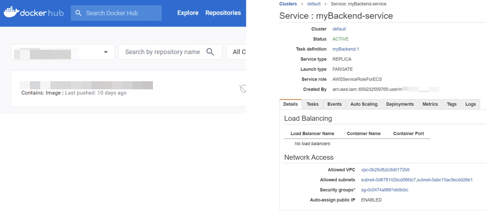
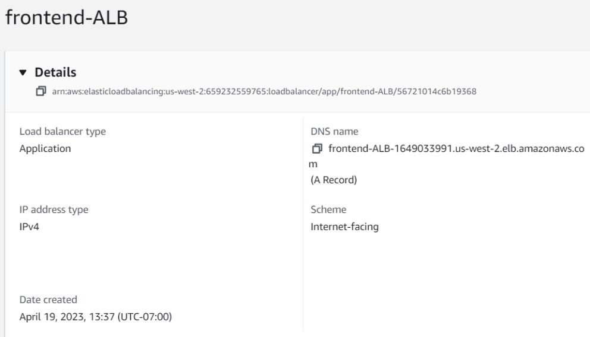
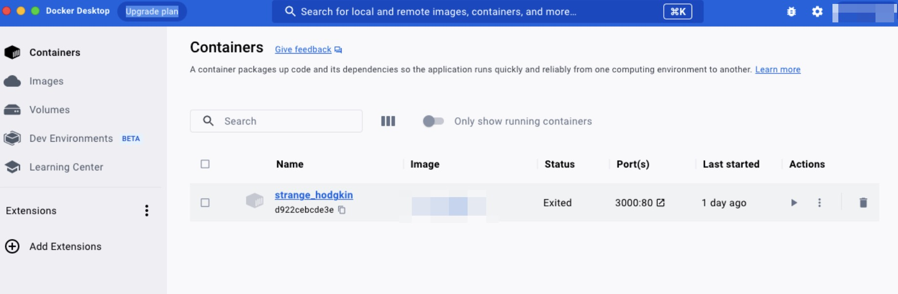
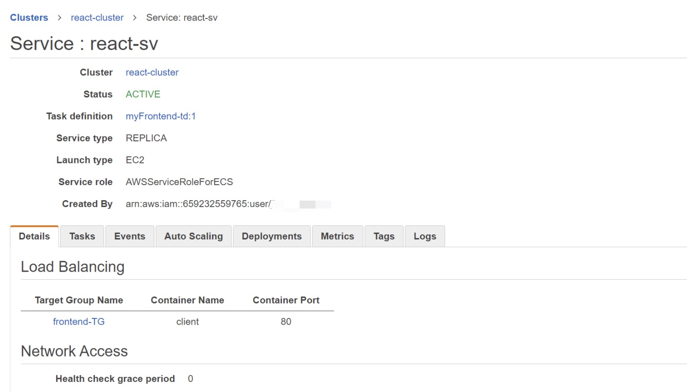
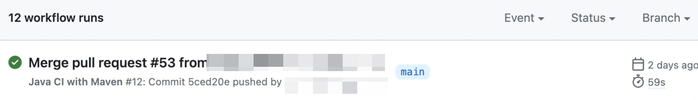
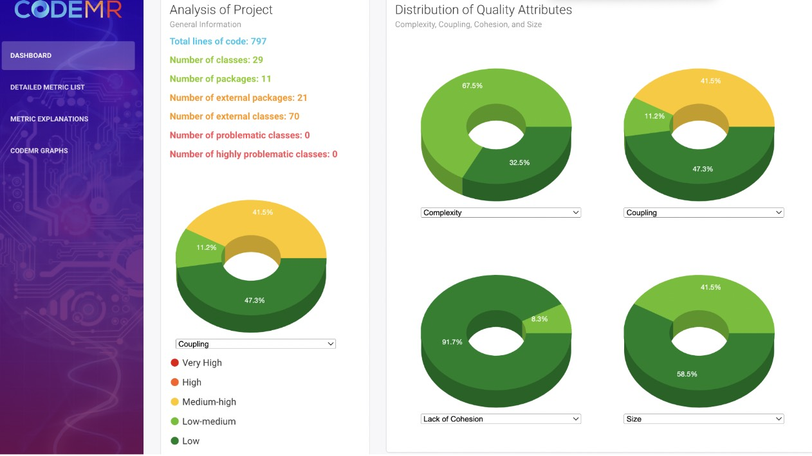
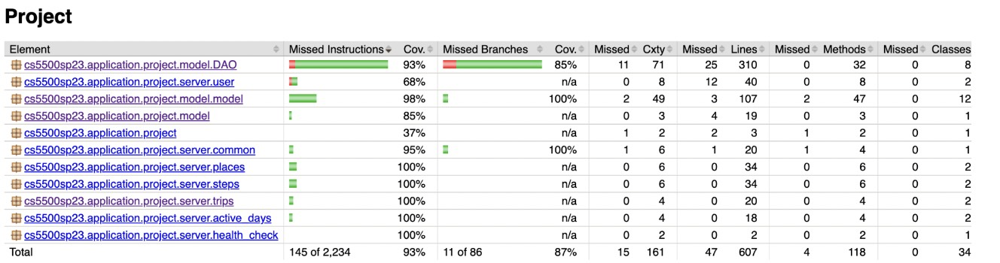

# Life-Track-App

LifeTrack360 is a comprehensive lifestyle tracking app that enables users to monitor their calorie intake, fitness progress, and location insights on website.

With personalized profile management, daily step count monitoring, and weekly location analysis, users can make informed decisions about their diet, exercise routines, and travel plans.

The app is securely deployed on AWS using Docker and AWS ECS, ensuring a seamless user experience through any web browser. The development team utilizes Github Actions to ensure consistent testing, and building of code changes.

## Tools and Frameworks

- Database: DynamoDB
- Frontend: React
- Backend: Spring Boot
- Deployment:
  Utilize AWS IAM Roles
  Frontend: docker, AWS ECS, EC2 with AWS ALB
  Backend: docker, AWS ECS, Fargate

## Repository Structure

This repository contains the source code for the LifeTrack360 app, organized into the following folders:

- `Frontend`: Contains the source code for the web-based user interface, including HTML, CSS, and JavaScript files.
- `Backend`: Contains the source code for the server-side logic, including database access and API implementation.
- `Backend/.github`: Contains the configuration files for the continuous integration (CI) pipeline using Github Actions.

## Getting Started

To set up the development environment for LifeTrack360, follow these steps:

1. Clone the repository:

   ```
   git clone https://github.com/xinyicheng1998/Life-Track-App.git
   cd Life-Track-App
   ```

2. Set up the frontend React project using your preferred IDE or build tool. Following the instruction in `Frontend`

3. Set up the backend Spring Boot project using your preferred IDE or build tool, such as Maven. Following the instruction in `Backend`

4. Start the development servers:

   - Frontend:

     ```
     cd frontend
     npm start
     ```

   - Backend:

     Run the Spring Boot application from your IDE or using the command line with Maven or Gradle.

## Contributing

We welcome contributions from the community. To contribute, please follow these steps:

1. Fork the repository and create a new branch with a descriptive name.
2. Make your changes in the new branch.
3. Commit your changes and push them to your fork.
4. Create a pull request from your branch to the main repository.

Please ensure that your code follows best practices, and include any necessary tests or documentation updates.

## Preview

### Frontend

#### Web page 1: Activity

the calories spent by the given user everyday within the time range

#### Web page 2：Visited times for places

groups the location data by place and calculates the total time the user visited at each place within time range

#### Web page 3: Longest stayed places

groups the location data by place and calculates the duration the user spent at each place within time range

### Backend

#### Endpoints

| Method | Endpoint                | Params                                         |
| ------ | ----------------------- | ---------------------------------------------- |
| GET    | /health-check           | null                                           |
| GET    | /active-days            | String personId                                |
| GET    | /most-steps             | String personId, String date, String daysAfter |
| GET    | /all-steps              | String personId, String date, String daysAfter |
| GET    | /longest-trips          | String personId, String date, String daysAfter |
| GET    | /most-visited-places    | String personId, String date, String daysAfter |
| GET    | /longest-visited-places | String personId, String date, String daysAfter |




### Deployment

#### Utilize AWS IAM Roles



#### Deployment Backend



#### Deployment Frontend





### Code Quality

#### GitHub Actions



#### CodeMR



#### Unit tests


